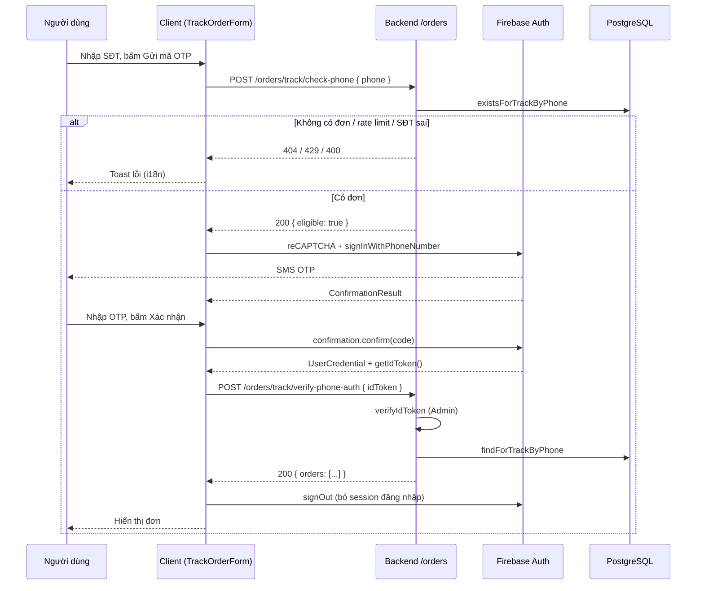

# Tra cứu đơn theo SĐT — luồng xác thực Firebase Phone Auth

##

Tài liệu mô tả **luồng verify OTP để track order status**.
SMS OTP do **Firebase Authentication (Phone)** trên client;
backend chỉ **kiểm tra có đơn** và **xác thực ID token**.

## 1. Tổng quan

**Storefront (Next.js)**: Người dùng nhập số điện thoại, sau đó gọi API để kiểm tra xem số đó có đơn hàng hay không. Nếu có đơn hàng hợp lệ, client sẽ tạo reCAPTCHA và gửi SMS thông qua Firebase, sau đó người dùng nhập mã OTP nhận được, gửi `idToken` lên backend và nhận lại danh sách đơn hàng từ backend.

**API (Express)**: Cung cấp hai endpoint: `/track/check-phone` để chuẩn hóa và xác thực số điện thoại, kiểm tra cơ sở dữ liệu có đơn hàng phù hợp và giới hạn truy cập theo IP; `/track/verify-phone-auth` để xác thực `idToken` qua Firebase Admin và trả về danh sách đơn hàng tương ứng.

**Firebase (Web SDK)**: Thực hiện invisible reCAPTCHA, sử dụng `signInWithPhoneNumber` để gửi SMS OTP đến người dùng, xác thực OTP bằng `confirm`. Toàn bộ chi phí gửi SMS sẽ tính theo Firebase.

**Firebase Admin (backend)**: Sử dụng `verifyIdToken` để xác thực ID token nhận từ client và lấy số điện thoại đã xác minh từ Firebase.

**Redis (tùy chọn)**: Sử dụng để giới hạn tần suất thao tác theo địa chỉ IP ở nhiều bước khác nhau, nhằm giảm tình trạng spam hoặc gửi quá nhiều OTP.

## 2. Sơ đồ luồng

---

## 3. Các bước chi tiết

### Bước A — Kiểm tra SĐT có đơn (trước SMS)

1. Client validate format cục bộ (`0xxxxxxxxx` hoặc `+84...`).
2. `POST /orders/track/check-phone` với body `{ "phone": "<chuỗi người dùng>" }`.
3. Server:
   - (Nếu có Redis) tăng bộ đếm theo IP, key `order-track:check-phone:ip:<ip>` — giới hạn `ORDER_TRACK_OTP_MAX_REQUESTS` / cửa sổ `ORDER_TRACK_OTP_RATE_LIMIT_WINDOW_SEC`.
   - `normalizeVietnamPhone` — không hợp lệ → 400.
   - `existsForTrackByPhone` — không có đơn → 404, message `NO_ORDER_FOR_PHONE`.
4. Chỉ khi `success === true` client mới tạo **reCAPTCHA mới** và gọi `signInWithPhoneNumber` (tránh tốn SMS khi không có đơn).

### Bước B — Gửi SMS (Firebase, client)

1. Mỗi lần gửi: `disposeRecaptcha` + `flushSync` tăng `recaptchaMountKey` → mount DOM node mới (`recaptcha-container-<n>`) để tránh lỗi _reCAPTCHA has already been rendered_.
2. `RecaptchaVerifier` (invisible) + `signInWithPhoneNumber(auth, e164, verifier)`.
3. Lưu `ConfirmationResult` trong ref; chuyển bước nhập OTP.

### Bước C — Xác nhận OTP và lấy đơn

1. `confirmation.confirm(code)` → `getIdToken()`.
2. `POST /orders/track/verify-phone-auth` với `{ "idToken": "..." }`.
3. Server:
   - Rate limit IP, key `order-track:otp-req:ip:<ip>` (bucket riêng với check-phone).
   - `verifyIdToken(idToken, true)` — lỗi → 401; nếu đã tăng Redis thì **decr** để không “ăn” slot khi token sai.
   - Lấy `phone_number` từ claims, chuẩn hóa VN, kiểm tra lại `existsForTrackByPhone`, rồi `findForTrackByPhone`.
4. Client: nếu thành công → `signOut` Firebase, hiển thị danh sách đơn (id, status, createdAt, finalAmount, currency).

### Bước D — Phiên OTP hết hạn (UX)

- Nếu Firebase / Identity Toolkit trả lỗi dạng `SESSION_EXPIRED`, `auth/session-expired`, `auth/code-expired`, hoặc `Error code: 39` (trong message/customData): toast **“OTP đã hết hạn. Vui lòng gửi lại mã OTP mới.”**, **khóa nút Xác nhận** (`otpConfirmBlocked`), xóa `ConfirmationResult`.
- Người dùng dùng **Gửi lại mã OTP** (lặp B) hoặc **Đổi số** để reset trạng thái.

---

## 4. API

Cả hai route gắn dưới prefix API thực tế của server (cùng mount `apiRouter` với `/orders`).

| Method | Path                              | Body                    | Thành công                                    |
| ------ | --------------------------------- | ----------------------- | --------------------------------------------- |
| `POST` | `/orders/track/check-phone`       | `{ "phone": string }`   | `200`, `data: { eligible: true }`             |
| `POST` | `/orders/track/verify-phone-auth` | `{ "idToken": string }` | `200`, `data: { orders: OrderTrackPublic[] }` |

`OrderTrackPublic`: `id`, `status`, `createdAt` (ISO), `finalAmount`, `currency`.

Response lỗi thống nhất dạng `ServiceResponse`: `success`, `message`, `statusCode` (và đôi khi `data` phụ).

---

## 5. Khớp SĐT trong database

Repository so khớp **JSON** trên bảng đơn:

- `contact.phone`
- `shippingInfo.receiver_phone`

Các biến thể sau khi chuẩn hóa (ví dụ `0395…`, `+8495…`, `8495…`) đều được thử — cùng logic với `normalizeVietnamPhone` / `matchVariants` trong backend.

---

## 6. Biến môi trường

### Backend (`backend/.env`)

- `FIREBASE_SERVICE_ACCOUNT_JSON` — JSON service account (hoặc ADC trên GCP).
- `REDIS_URL` — tùy chọn; không có Redis thì không rate limit hai endpoint trên.
- `ORDER_TRACK_OTP_MAX_REQUESTS`, `ORDER_TRACK_OTP_RATE_LIMIT_WINDOW_SEC` — dùng chung cho script rate limit (hai key Redis khác nhau như mục 3).

### Client (`frontend/client/.env`)

- `NEXT_PUBLIC_FIREBASE_API_KEY`
- `NEXT_PUBLIC_FIREBASE_AUTH_DOMAIN`
- `NEXT_PUBLIC_FIREBASE_PROJECT_ID`
- `NEXT_PUBLIC_FIREBASE_APP_ID`
- `NEXT_PUBLIC_API_URL` — base URL backend (Axios).

Cần **cùng Firebase project** giữa Web app (client) và service account (Admin).

---

## 7. Firebase Console (tối thiểu)

- **Authentication → Sign-in method**: bật **Phone**.
- **Authentication → Settings → Authorized domains**: `localhost`, `127.0.0.1`, domain production.
- **Google Cloud → Credentials**: API key trình duyệt không chặn sai HTTP referrer cho môi trường dev (`http://localhost:*`, `http://127.0.0.1:*`).
- Lỗi `auth/invalid-app-credential` trên localhost: thường do domain/key/referrer; thử mở app bằng `http://127.0.0.1:<port>`.

---

## 8. File tham chiếu trong repo

| Khu vực            | File                                                                              |
| ------------------ | --------------------------------------------------------------------------------- |
| UI luồng           | `frontend/client/app/(store)/order/track/TrackOrderForm.tsx`                      |
| Gọi API            | `frontend/client/features/order/orderTrack.api.ts`                                |
| Toast EN→VI        | `frontend/client/features/order/orderTrack.i18n.ts`                               |
| Lỗi Firebase / OTP | `frontend/client/lib/firebaseUtils.ts`                                            |
| Firebase Web init  | `frontend/client/lib/firebaseClient.ts`                                           |
| Endpoint constants | `frontend/client/lib/constants.ts` (`ORDER_TRACK_*`)                              |
| Service            | `backend/src/api/order/orderService.ts` (`checkPhoneForTrack`, `verifyPhoneAuth`) |
| Router + OpenAPI   | `backend/src/api/order/orderRouter.ts`                                            |
| Schema Zod         | `backend/src/api/order/orderModel.ts`                                             |
| Rate limit keys    | `backend/src/common/utils/otpRateLimit.ts`                                        |
| Chuẩn hóa SĐT      | `backend/src/common/utils/otpVerification.ts`                                     |
| Firebase Admin     | `backend/src/common/lib/firebase-admin.ts`                                        |
| Message hằng       | `backend/src/common/constants/index.ts` (`OTP_MESSAGES`)                          |

---

## 9. Bảo mật & vận hành

- **Không lưu mã OTP** trên server; chỉ tin `phone_number` sau khi verify token.
- **check-phone** tiết lộ “có đơn hay không” theo SĐT — đã chấp nhận để tránh SMS lãng phí; rate limit IP giảm quét số.
- **verify-phone-auth** kiểm tra lại đơn sau token — tránh kịch bản token hợp lệ nhưng SĐT không khớp policy đơn.

---
