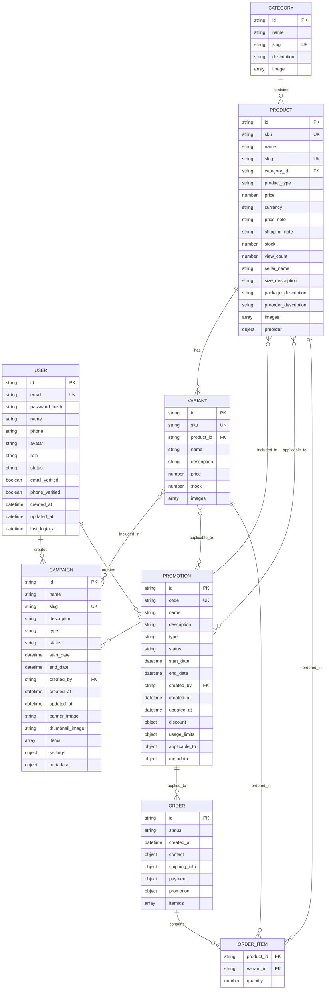

# Entity Relationship Diagram (ERD)

Lược đồ quan hệ giữa các bảng trong hệ thống Sticker Web

## Mermaid ERD Diagram

## Mối quan hệ chi tiết

### 1. USER (Người dùng)
- **1:N** với CAMPAIGN (một user tạo nhiều campaign)
  - Foreign Key: `campaign.created_by` → `user.id`
- **1:N** với PROMOTION (một user tạo nhiều promotion)
  - Foreign Key: `promotion.created_by` → `user.id`

### 2. CATEGORY (Danh mục)
- **1:N** với PRODUCT (một category chứa nhiều product)
  - Foreign Key: `product.category_id` → `category.id`

### 3. PRODUCT (Sản phẩm)
- **N:1** với CATEGORY (nhiều product thuộc một category)
  - Foreign Key: `product.category_id` → `category.id`
- **1:N** với VARIANT (một product có nhiều variant)
  - Foreign Key: `variant.product_id` → `product.id`
- **N:M** với CAMPAIGN (nhiều product có thể trong nhiều campaign)
  - Quan hệ qua `campaign.items[].product_id`
- **N:M** với PROMOTION (nhiều product có thể áp dụng nhiều promotion)
  - Quan hệ qua `promotion.applicable_to.products[]`
- **1:N** với ORDER_ITEM (một product có trong nhiều order item)
  - Foreign Key: `order.itemIds[].product_id` → `product.id`

### 4. VARIANT (Phân loại sản phẩm)
- **N:1** với PRODUCT (nhiều variant thuộc một product)
  - Foreign Key: `variant.product_id` → `product.id`
- **N:M** với CAMPAIGN (nhiều variant có thể trong nhiều campaign)
  - Quan hệ qua `campaign.items[].variant_id`
- **N:M** với PROMOTION (nhiều variant có thể áp dụng nhiều promotion)
  - Quan hệ qua `promotion.applicable_to.variants[]`
- **1:N** với ORDER_ITEM (một variant có trong nhiều order item)
  - Foreign Key: `order.itemIds[].variant_id` → `variant.id`

### 5. CAMPAIGN (Chiến dịch)
- **N:1** với USER (nhiều campaign được tạo bởi một user)
  - Foreign Key: `campaign.created_by` → `user.id`
- **N:M** với PRODUCT (nhiều campaign chứa nhiều product)
  - Quan hệ qua `campaign.items[].product_id`
- **N:M** với VARIANT (nhiều campaign chứa nhiều variant)
  - Quan hệ qua `campaign.items[].variant_id`

### 6. PROMOTION (Khuyến mãi)
- **N:1** với USER (nhiều promotion được tạo bởi một user)
  - Foreign Key: `promotion.created_by` → `user.id`
- **1:N** với ORDER (một promotion có thể áp dụng cho nhiều order)
  - Foreign Key: `order.promotion.promotion_id` → `promotion.id`
- **N:M** với PRODUCT (nhiều promotion áp dụng cho nhiều product)
  - Quan hệ qua `promotion.applicable_to.products[]`
- **N:M** với VARIANT (nhiều promotion áp dụng cho nhiều variant)
  - Quan hệ qua `promotion.applicable_to.variants[]`

### 7. ORDER (Đơn hàng)
- **1:N** với ORDER_ITEM (một order chứa nhiều order item)
  - Quan hệ qua `order.itemIds[]`
- **N:1** với PROMOTION (nhiều order có thể dùng một promotion)
  - Foreign Key: `order.promotion.promotion_id` → `promotion.id`

### 8. ORDER_ITEM (Chi tiết đơn hàng)
- **N:1** với PRODUCT (nhiều order item thuộc một product)
  - Foreign Key: `order.itemIds[].product_id` → `product.id`
- **N:1** với VARIANT (nhiều order item thuộc một variant, optional)
  - Foreign Key: `order.itemIds[].variant_id` → `variant.id`
- **N:1** với ORDER (nhiều order item thuộc một order)
  - Quan hệ qua `order.itemIds[]`

## Ghi chú

- **PK**: Primary Key (Khóa chính)
- **FK**: Foreign Key (Khóa ngoại)
- **UK**: Unique Key (Khóa duy nhất)
- **1:N**: One-to-Many (Một-nhiều)
- **N:1**: Many-to-One (Nhiều-một)
- **N:M**: Many-to-Many (Nhiều-nhiều)
- **1:1**: One-to-One (Một-một)

## Các quan hệ đặc biệt

1. **Campaign Items**: Campaign có thể chứa cả product và variant thông qua mảng `items[]`
2. **Promotion Applicable To**: Promotion có thể áp dụng cho tất cả sản phẩm (`all_products: true`) hoặc chỉ một số product/variant cụ thể
3. **Order Items**: Order chứa mảng `itemIds[]` với thông tin product_id, variant_id (optional), và quantity
4. **Order Contact**: Order không có foreign key trực tiếp đến User, mà lưu thông tin contact riêng (email, phone, social_link)
